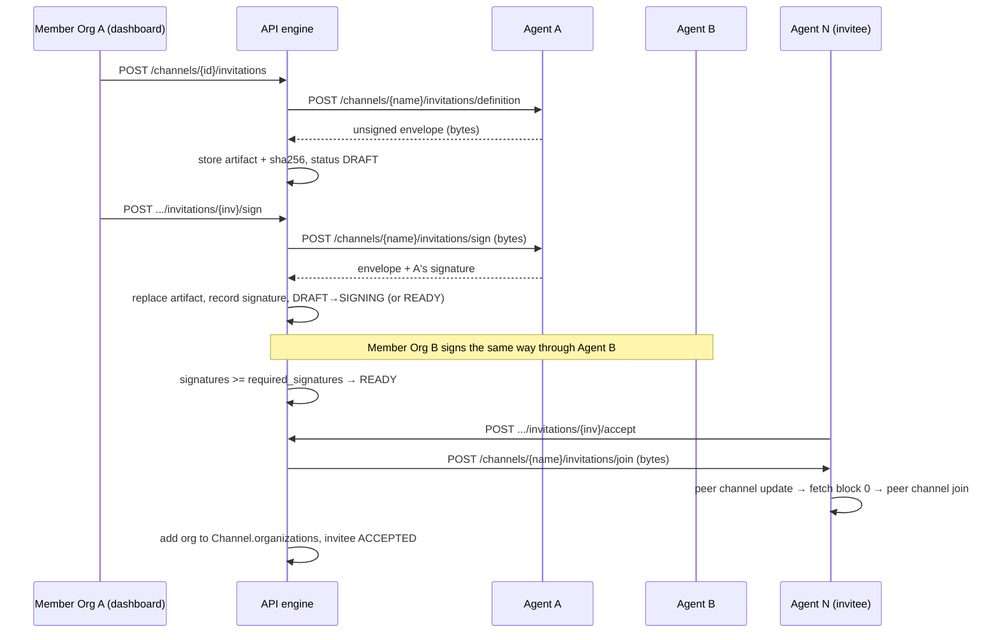
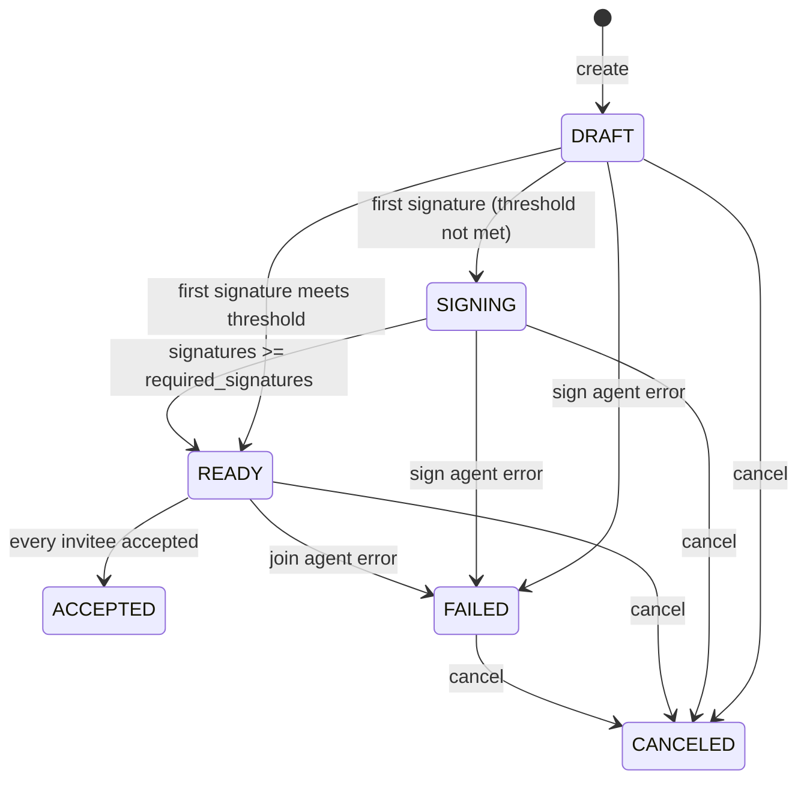

[//]: # (SPDX-License-Identifier: CC-BY-4.0)

# Channel Invitation Workflow

## Overview

Adding an organization to an existing Fabric channel is a channel config
update that the current members have to sign before it can be submitted.
Cello models this as a **channel invitation**:

1. A channel member invites one or more organizations.
2. The member's agent builds an unsigned config update envelope. The API engine
   stores it as the invitation **artifact**.
3. Channel members sign that artifact one at a time. Each signature is
   added to the same envelope, the way people sign a paper contract in turn.
4. Once enough members have signed, the invitation becomes `READY` and the
   invited organizations can see it.
5. When an invited organization accepts, its agent submits the signed update,
   fetches the channel genesis block, and joins its peer to the channel.

The work is split across Cello's existing layers:

| Layer | Responsibility |
| --- | --- |
| `src/api-engine` | Source of truth for invitation state, invitees, signatures, and artifact storage. Orchestrates agent calls. |
| `src/agents/hyperledger-fabric` | Runs Fabric tools (`peer`, `configtxlator`) to build, sign, and submit the config update. Works on raw bytes only. |
| `src/dashboard` | Channel table entry point, invitation list page, and create/sign/accept/reject/cancel actions. |

The old `add_organization` endpoint and the dashboard's "Update Channel"
modal were removed. The invitation workflow is now the only way to add an
organization to a channel.

## Sequence



## Organization MSP IDs

Fabric identifies organizations by MSP ID, so `Organization` now has an
`msp_id` field (`src/api-engine/organization/models.py`):

* `msp_id` is unique. On registration it is optional. When omitted, it is
  derived from the organization name: the first DNS label, capitalized, with an
  `MSP` suffix (for example `org1.cello.com` → `Org1MSP`).
* `POST /api/v1/register` accepts `msp_id`. Admins can also set or change it
  through `POST /api/v1/organizations` and `PUT /api/v1/organizations/{id}`.
  Both endpoints require an admin user.
* `agent_url` is now nullable. If the agent can't be reached during
  organization creation, Cello logs a warning and still creates the database
  record.

The agent maps an MSP ID back to an entry in its crypto config by removing
`MSP` (`Org2MSP` → `Org2`). That name must match a `PeerOrgs[].Name` in the
agent's `crypto-config.yaml`.

## Data Model

Defined in `src/api-engine/channel/models.py`
(migrations `0002_channel_invitation`, `0003_channel_invitation_indexes`).

### `ChannelInvitation`

| Field | Notes |
| --- | --- |
| `id` | UUID |
| `channel` | FK → `Channel` (`related_name="invitations"`) |
| `creator_organization` | FK → `Organization` |
| `status` | `DRAFT`, `SIGNING`, `READY`, `ACCEPTED`, `REJECTED`, `FAILED`, `CANCELED` (indexed) |
| `artifact` | `FileField`, `upload_to="channel_invitations/"` |
| `artifact_hash` | SHA-256 of the current artifact bytes |
| `required_signatures` | Signature threshold (see below) |
| `error_message` | Set when an agent operation fails |
| `created_at`, `updated_at` | Timestamps |

### `ChannelInvitationInvitee`

One row per invited organization. `status` is `PENDING`, `ACCEPTED`, or
`REJECTED`. `responded_at` is set when the organization accepts or rejects.
Unique on `(invitation, organization)`.

### `ChannelInvitationSignature`

One row per signing member organization. It records the `artifact_hash` produced
by that signature and `signed_at`. Unique on `(invitation, organization)`, so an
organization can sign only once.

### Artifact storage

The API engine stores artifacts in its own volume under
`MEDIA_ROOT/channel_invitations/channel_update_<channel>.bin`. Each signature
saves a new file, and Django adds a suffix to make the name unique. The
invitation points at the newest file. Older versions are not deleted. Agents
never keep the artifact after a request finishes: they write it to a temporary
file under `CELLO_HOME/<channel>/`, run the Fabric command, and remove the file
in a `finally` block.

## State Machine



Behavior:

* **Threshold.** If `required_signatures` is omitted, it defaults to a simple
  majority of current members, `(member_count // 2) + 1`. It can be set
  explicitly, with a minimum of 1 and a maximum of the member count. The API
  engine only counts signatures. It does not check the channel's Fabric
  `Admins` policy, so the configured threshold has to be at least what that
  policy requires, or the `peer channel update` on accept will fail.
* **Accept with several invitees.** Each accepting invitee sets its own invitee
  row to `ACCEPTED` and is added to `Channel.organizations`. The invitation
  moves to `ACCEPTED` only when no invitee is still `PENDING`.
* **Reject.** Reject sets only the invitee row to `REJECTED`. The invitation
  stays `READY`. The invitation-level `REJECTED` status exists in the model
  but nothing sets it yet.
* **Failure.** Agent errors during sign or accept set the invitation to
  `FAILED` with a generic `error_message` (`"Signing operation failed."` or
  `"Accept operation failed."`). There is no retry endpoint. A failed
  invitation can only be canceled, and a new invitation has to be created.
* **Create failure.** The agent call that builds the artifact runs before any
  database write. If it fails, the API returns HTTP 500 and creates no rows.

## Visibility and Authorization

All endpoints require an authenticated user. The rules are based on the
user's organization. Invitation endpoints have no extra admin-only check.

`ChannelInvitation.objects.visible_to_organization(org)` returns:

* every invitation on channels where `org` is a member, in any status, and
* invitations where `org` is an invitee **and** the status is `READY`,
  `ACCEPTED`, `REJECTED`, or `FAILED`.

Invited organizations can't see `DRAFT`, `SIGNING`, or `CANCELED`
invitations. Organizations that are neither members nor invitees can't see
the invitation at all.

| Action | Who | Allowed invitation status | Other checks |
| --- | --- | --- | --- |
| Create | Channel member | n/a | Invitees exist, are not already members, and have no active (`DRAFT`/`SIGNING`/`READY`) invitation on this channel. No duplicates in the request. |
| Sign | Channel member | `DRAFT`, `SIGNING` | Member has not signed already |
| Accept | Pending invitee | `READY` | n/a |
| Reject | Pending invitee | `READY` | n/a |
| Cancel | Channel member or pending invitee | `DRAFT`, `SIGNING`, `READY`, `FAILED` | An invitee that has already responded gets HTTP 403 |

If the caller is not authorized, the API returns HTTP 404 instead of 403 so
the response does not reveal that the invitation exists.

## API Engine Endpoints

Implemented on `ChannelViewSet` and `InvitationViewSet` in
`src/api-engine/channel/views.py`. Responses use the standard
`{status, data, msg}` envelope.

| Method | Path | Description |
| --- | --- | --- |
| `GET` | `/api/v1/invitations` | Paginated list of all invitations visible to the current organization, across channels. |
| `GET` | `/api/v1/channels/{channel_id}/invitations` | Paginated list of visible invitations on one channel. |
| `POST` | `/api/v1/channels/{channel_id}/invitations` | Create an invitation. |
| `GET` | `/api/v1/channels/{channel_id}/invitations/{invitation_id}` | Retrieve one invitation. |
| `POST` | `/api/v1/channels/{channel_id}/invitations/{invitation_id}/sign` | Sign with the caller organization's agent. |
| `POST` | `/api/v1/channels/{channel_id}/invitations/{invitation_id}/accept` | Accept and join with the caller organization's agent. |
| `POST` | `/api/v1/channels/{channel_id}/invitations/{invitation_id}/reject` | Reject. |
| `POST` | `/api/v1/channels/{channel_id}/invitations/{invitation_id}/cancel` | Cancel. |

Create request body. Provide exactly one of `organization_ids` or
`organization_names`:

```json
{
  "organization_names": ["org2.cello.com"],
  "required_signatures": 1
}
```

Invitation response (`ChannelInvitationResponse`):

```json
{
  "id": "…",
  "channel": {"id": "…", "name": "mychannel"},
  "creator_organization": {"id": "…"},
  "status": "SIGNING",
  "artifact_hash": "…",
  "required_signatures": 2,
  "error_message": "",
  "invitees": [
    {"id": "…", "organization": {"id": "…", "name": "org2.cello.com"},
     "status": "PENDING", "responded_at": null}
  ],
  "signatures": [
    {"id": "…", "organization": {"id": "…", "name": "org1.cello.com"},
     "artifact_hash": "…", "signed_at": "…"}
  ],
  "created_at": "…",
  "updated_at": "…"
}
```

### Agent calls

`src/api-engine/channel/service.py` calls agents at
`<agent_url>/api/v1/…`. It accepts `agent_url` with or without a trailing
`/api/v1`. If the `AGENT_AUTH_TOKEN` environment variable is set, each call
sends it in an `X-Agent-Token` header. The Fabric agent does not validate that
header yet.

## Fabric Agent Endpoints

Implemented in `src/agents/hyperledger-fabric/channel/views.py` and
`channel/service.py`. Every endpoint works on request and response bodies.
None of them depend on files shared with the API engine.

| Method | Path | Request | Response | Fabric operations |
| --- | --- | --- | --- | --- |
| `POST` | `/api/v1/channels/{channel_name}/invitations/definition` | JSON `{"organization_msp_ids": [...]}` | `application/octet-stream` envelope | `peer channel fetch config`, `configtxlator proto_decode`, adds an org group to `Application.groups` for each MSP ID, `proto_encode`, `compute_update`, wraps the update in a `common.Envelope` |
| `POST` | `/api/v1/channels/{channel_name}/invitations/sign` | `application/octet-stream` envelope | `application/octet-stream` signed envelope | `peer channel signconfigtx` with the org's `Admin@<domain>` MSP |
| `POST` | `/api/v1/channels/{channel_name}/invitations/join` | `application/octet-stream` signed envelope | `200 OK` | `peer channel update`, `peer channel fetch 0`, `peer channel join` |

`_build_org_group` creates each invited organization's group with:

* MSP values (`root_certs`, `admin_sign_certs`, `tls_root_certs`) read from
  `CELLO_HOME/peerOrganizations/<domain>/msp/`,
* an anchor peer at `<first spec hostname>.<domain>:7051`, and
* `Readers`, `Writers`, `Admins`, and `Endorsement` signature policies for
  that MSP.

## Dashboard

* **Route:** `/channel/invitation` (`src/dashboard/src/pages/Channel/Invitation.js`),
  listed in the Channel menu. It reads an optional `?channel=<id>` query
  parameter and has a channel selector. With no channel selected, it uses
  `GET /api/v1/invitations`.
* **Entry point:** each row in the channel table has an **Invitations** link
  that opens the page filtered to that channel.
* **Create:** `forms/CreateInvitationForm.js` lists organizations that are not
  already channel members. It submits `organization_names` and an optional
  `required_signatures`.
* **Actions:** `computeRecordFlags` decides which buttons to show:
    * `Sign`: the user's organization is a channel member and the status is
      `DRAFT` or `SIGNING`.
    * `Accept` / `Reject`: the user's organization is a pending invitee and the
      status is `READY`.
    * `Cancel`: the status can be canceled and the user's organization is a
      member or a pending invitee.
    * `FAILED` invitations show `error_message` in a tooltip.
* **Channel creation:** the create modal now loads node counts and disables
  creation, with a warning, until the organization has at least one peer and
  one orderer.
* **Organization form:** includes `agent_url` and `msp_id` fields.
* **State:** `services/invitation.js` and `models/invitation.js` (dva), with
  `en-US` and `zh-CN` locale strings in `locales/*/Channel.js`.

## Known Limitations and Proposed Follow-ups

The current implementation covers the single-agent, one-invitee path. The
items below need changes before the workflow is robust across separately
deployed organizations. Each entry describes the problem and the proposed fix.
Most of the fixes follow Fabric's
[Adding an Org to a Channel](https://hyperledger-fabric.readthedocs.io/en/latest/channel_update_tutorial.html)
flow.

### 1. Invitee crypto material must be on the creator's agent

**Problem.** `generate_invitation_definition` runs on the creator's agent and
reads each invited organization's certificates from that agent's own
`CELLO_HOME` and `crypto-config.yaml`. If organizations run separate agents
with separate volumes, the invitee's MSP material is not there, so the
definition step fails.

**Proposed fix.** Have the joining organization supply its own definition, as
`configtxgen -printOrg <MSP>` does in the Fabric tutorial:

* Add `GET /api/v1/organizations/definition` to the Fabric agent. It returns
  the organization group JSON (MSP certificates, anchor peers, policies). This
  JSON contains only public material.
* When creating an invitation, the API engine fetches this JSON from each
  invitee's agent and passes it to the creator's agent in the `definition`
  request.
* `_build_org_group` uses the JSON it receives instead of reading local files.

### 2. Accept both submits the update and joins

**Problem.** The artifact is one config update that adds every invitee. The
first invitee to accept submits it with `peer channel update`. Later invitees
submit the same update again, and Fabric rejects it because of the version
conflict. Also, once the update is applied, every invitee is in the channel
config, including invitees that later reject.

**Proposed fix.** Allow only **one invitee per invitation**. Accept and reject
then reflect a real decision, and inviting several organizations means
creating several invitations. The alternative is to submit the update when the
invitation reaches `READY` and have accept only fetch block 0 and join. That
supports several invitees, but reject would no longer remove the organization
from the channel config.

### 3. Concurrent invitations on the same channel

**Problem.** Each update is computed against the channel config version that
exists when the invitation is created. If two invitations for different
organizations are pending on the same channel, the second one submitted fails
with a version mismatch.

**Proposed fix.** Allow only one active (`DRAFT`, `SIGNING`, or `READY`)
invitation per channel. Separately, if submission fails with a version
mismatch, offer to regenerate the update. Members would then have to sign the
new update again.

### 4. Signature threshold vs. Fabric policy

**Problem.** The API engine only counts signatures. If `required_signatures`
is lower than what the channel's `Admins` policy requires, the invitation
becomes `READY`, but `peer channel update` fails when the invitee accepts.

**Proposed fix.** Reject thresholds below a majority of members. The default
`Admins` policy (`ImplicitMeta MAJORITY Admins`) requires a majority, which
the current `(n // 2) + 1` default already matches. A fuller fix is to have
the agent read the policy from the channel config and report the required
count.

### 5. No retry for `FAILED`

**Problem.** A failed sign or accept leaves the invitation `FAILED`, and the
only option is to cancel it.

**Proposed fix.** Record the status the invitation was in before it failed
and allow the same action again. If the failure was a version mismatch,
regenerate the update instead (see item 3). Return the agent's error detail
in `error_message` rather than a generic message.

### 6. Smaller gaps

* **Invitation-level `REJECTED` is never set.** Set it when every invitee has
  rejected. With one invitee per invitation, that means as soon as the
  invitee rejects.
* **Old artifact versions are not removed** from `MEDIA_ROOT`. Delete the
  previous file after the new one is committed
  (`transaction.on_commit` → `old_file.delete(save=False)`).
* **Agent authentication.** The API engine sends `X-Agent-Token`, but the
  agent does not check it. Add a DRF permission class on the agent that
  compares the header with `hmac.compare_digest`. Mutual TLS between the API
  engine and agents would be stronger.

## Testing

Unit and flow tests:

* `src/api-engine/channel/tests.py`: model constraints, visibility, serializer
  validation, and endpoint authorization and state transitions (agent calls
  mocked).
* `src/api-engine/channel/tests_mock_flow.py`: full create → sign → sign →
  accept lifecycle with the agent HTTP layer mocked. It checks `agent_url`
  handling, that each signature builds on the previous artifact bytes, hash
  tracking, and membership updates.
* `src/agents/hyperledger-fabric/channel/tests.py`: agent serializers and
  services with `subprocess.run` and the filesystem mocked. It checks command
  construction, error propagation, and temp-file cleanup.
* `src/dashboard/src/__tests__/{services,models,pages/Channel}/…invitation…`:
  service URLs, model effects, and which action buttons are rendered.

Running them:

```bash
# API engine (conftest.py loads test_settings: in-memory SQLite, temp MEDIA_ROOT)
cd src/api-engine && pytest channel

# Fabric agent
cd src/agents/hyperledger-fabric && pytest channel

# Dashboard
cd src/dashboard && yarn lint && yarn test
```

`src/api-engine/channel/tests_integration.py` exercises the workflow against a
real agent and is skipped by default:

```bash
cd src/api-engine
RUN_INTEGRATION_TESTS=true AGENT_HOST=localhost AGENT_PORT=8080 \
  pytest channel/tests_integration.py
```

### Manual multi-organization check

Until follow-up 1 is done, both organizations have to be served by the same
agent (the same `CELLO_HOME`).

1. Register two organizations with distinct MSP IDs (for example `Org1MSP`,
   `Org2MSP`). Give each a peer, and give Org1 an orderer.
2. As Org1, create a channel. Then open **Channel → Invitations** and invite
   Org2.
3. Sign as Org1. With one member, the default threshold is 1, so the
   invitation becomes `READY`.
4. Log in as Org2. The invitation now appears. Click **Accept**.
5. Check that the channel lists Org2 as a member and that Org2's peer has
   joined (`peer channel list`).
